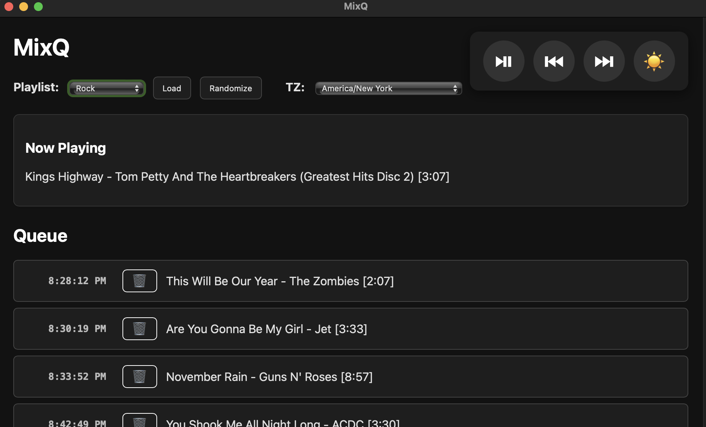

# MixQ

**MixQ** is a lightweight, local music queue controller for macOS that lets you build and manage radio-style playback queues using your existing Apple Music library — without ever interrupting what's currently playing.

Load any playlist from Music.app, drag to reorder, remove tracks, randomize the order, skip ahead, or pause/resume — all from a clean browser interface that runs entirely on your machine.

No cloud, no tracking, no accounts. 100% private and local.

## Features

- **Non-interruptive queue editing**  
  Load, shuffle, reorder, or remove songs while music continues playing uninterrupted

- **Accurate upcoming start times**  
  Shows clock time (with seconds) for each track in the queue, respecting your selected timezone

- **Dark mode**  
  Toggle between light & dark themes for comfortable listening at any hour

- **Queue persistence**  
  Your current queue survives browser reloads (saved in localStorage)

- **Native-feeling controls**  
  Play/Pause, Next, Previous — mapped directly to Music.app

- **Standalone macOS app**  
  Packaged with Briefcase → double-click launch, no terminal required

## Screenshots


## Requirements

- macOS (tested on Sonoma / Sequoia)
- Apple Music app (with local library access)
- Python 3.10+ (only needed if running from source)

## Installation (recommended – packaged app)

1. Download the latest release `.dmg` from the [Releases page](https://github.com/jimmydigital/MixQ/releases)
2. Open the `.dmg` → drag **MixQ.app** to Applications
3. Launch MixQ

## Running from source (development)

1. Clone the repo:
   ```bash
   git clone https://github.com/jimmydigital/MixQ.git
   cd MixQ
   ```

2. Create & activate venv:
   ```bash
   python3 -m venv venv
   source venv/bin/activate
   ```

3. Install dependencies:
   ```bash
   pip install -r MixQ/src/MixQ/requirements.txt
   ```

4. Run:
   ```bash
   cd MixQ; make test-local
   ```
   → Open http://127.0.0.1:8085 in your browser

## Building your own .app bundle (using Briefcase)

1. Install Briefcase:
   ```bash
   pip install briefcase
   ```

2. Create & build:
   ```bash
   make rebuild
   ```

3. Package for distribution:
   ```bash
   make package
   ```

## Contributing

Pull requests welcome!  
Especially interested in:
- Better time accuracy (elapsed/remaining from Music.app)
- Tray/menu bar integration
- Volume slider
- Export queue to Music playlist

## License

MIT License  
See [LICENSE](LICENSE) for full text.

---

